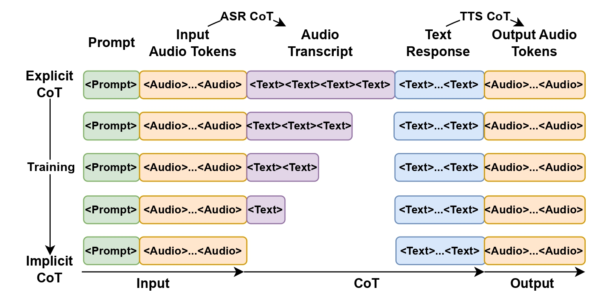
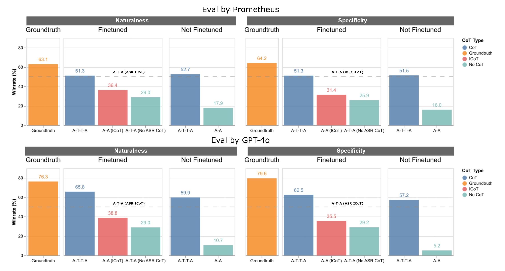

<h1 style="display: flex; justify-content: center; align-items: center; gap: 10px; margin: 0;">
  Internalizing ASR with Implicit Chain of Thought for Efficient Speech-to-Speech Conversational LLM
</h1>

## Abstract
Current speech-based LLMs are predominantly trained on extensive ASR and TTS datasets, excelling in tasks related to these domains. However, their ability to handle direct speech-to-speech conversations remains notably constrained. These models often rely on an ASR-to-TTS chain-of-thought pipeline, converting speech into text for processing before generating audio responses, which introduces latency and loses audio features. We propose a method that implicitly internalizes ASR chain of thought into a speech LLM, enhancing its native speech understanding capabilities. Our approach reduces latency and improves the model's native understanding of speech, paving the way for more efficient and natural real-time audio interactions. We also release a large-scale synthetic conversational dataset to facilitate further research.

  

## Results
Our model achieves a competitive average win rate of <strong>42.3%</strong> against groundtruth labels. This suggests that internalizing ASR CoT introduces only minor quality degradation.

  

## Setup

### For cuda machines
`make`

### For hpu machines
`make install-hpu`

## Run

`pdm start`

## Run linters
Run `pdm run lint`

## Run formatters
Run `pdm run lint-format`
